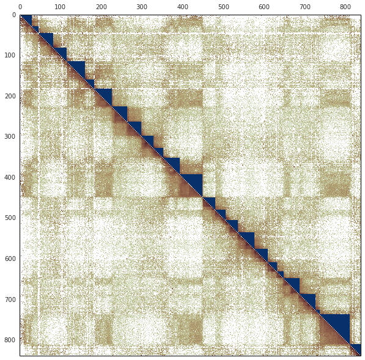
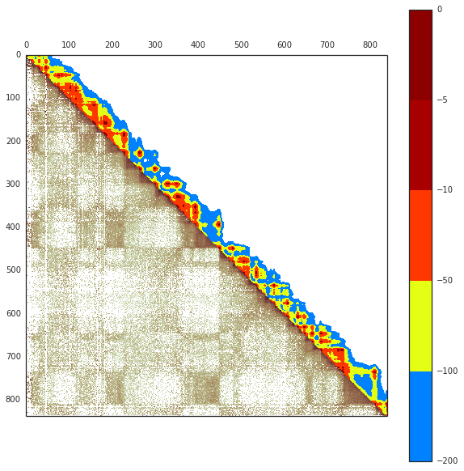
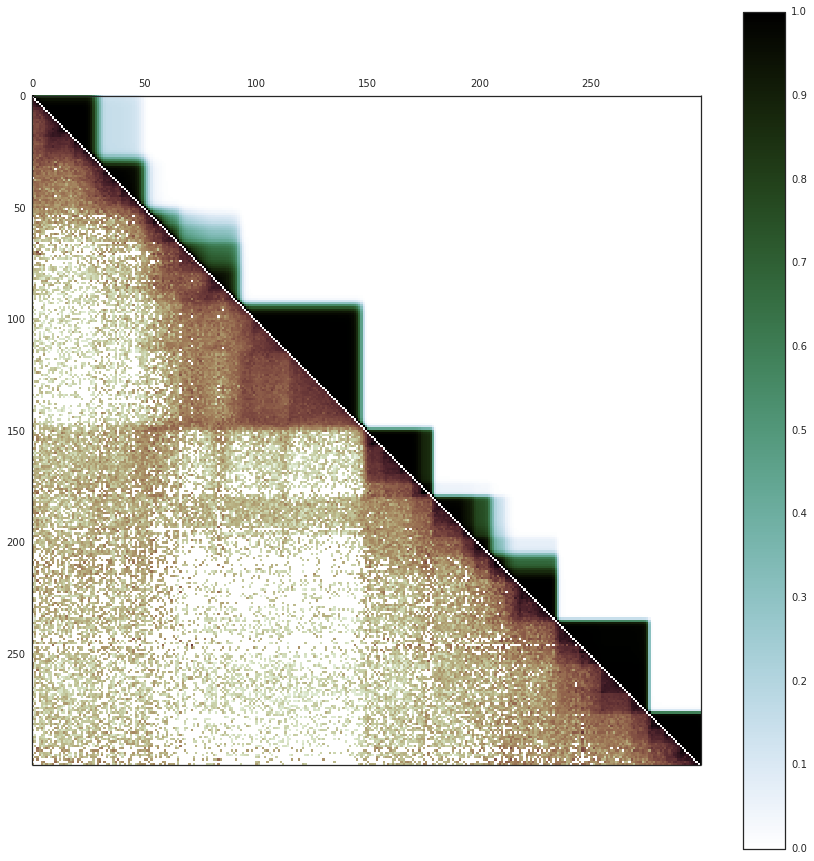

# Lavaburst #

Chromatin interactions bursting with flavor!

```python

import numpy as np
from lavaburst.plotting import make_triangles, mask_triu, mask_tril, rotate45
import lavaburst


A = np.loadtxt('<Hi-C-matrix-file>')

model = PottsSegmenter(A, gamma=4.0)

# Optimal segmentation
starts, scores = model.optimal_segmentation()
f = plt.figure()
ax = f.add_subplot(111)
ax.matshow(np.log(A))
ax.matshow(make_triangles(starts))
plt.show()

```


```python
# Boundary marginal distribution
beta = 10000
LzB = model.log_boundary_marginal(beta)
prob = np.exp(LzB - model.logZ(beta))
f = plt.figure()
ax = f.add_subplot(111)
ax.matshow(rotate45(np.log(A))[:100,:]), cmap=chx(0.6))
ax.plot(prob*(-100))
plt.show()
```


```python
# Segment marginal distribution
beta = 10000
LzS = model.log_segment_marginal(beta)
prob = np.exp(LzS - model.logZ(beta))
f = plt.figure()
ax = f.add_subplot(111)
ax.matshow(mask_tril(np.log(A)))
ax.matshow(mask_triu(prob))
plt.show()
```


```python
# Boundary co-occurrence marginal distribution
beta = 10000
LzBB = model.log_boundary_cooccur_marginal(beta)
prob = np.exp(LzBB - model.logZ(beta))
f = plt.figure()
ax = f.add_subplot(111)
ax.matshow(mask_tril(np.log(A)))
ax.matshow(mask_triu(prob))
plt.show()
```


```python
# Segment co-occurrence marginal distribution
beta = 20000
LzSS = model.log_segment_cooccur_marginal(beta)
log_prob = LzSS - model.logZ(beta)
f = plt.figure()
ax = f.add_subplot(111)
ax.matshow(mask_tril(np.log(A)))
cs = ax.contourf(mask_tril(log_prob), [-200, -100, -50, -10, -5, 0])
f.colorbar(cs)
plt.show()
```


```python
# We use Monte Carlo simulations to get the distribution
# of the number of boundaries in the ensemble at a given temperature
beta = 10000
states = model.metropolis_mcmc(beta)
counts, bin_edges = np.histogram(np.arange(len(A)), states.sum(axis=1))
f = plt.figure()
ax = f.add_subplot(111)
ax.bar(counts)
plt.show()
```

```